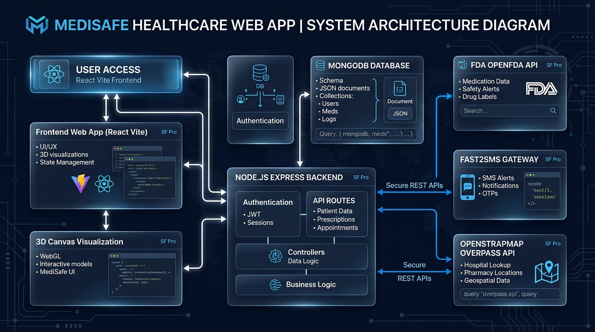

# 🏥 MediSafe — Smart Medicine Safety & Drug Interaction Assistant

[](https://hack-in-motion-ricr-him-1114.vercel.app/)
[](https://ai.google.dev/)
[](https://react.dev/)
[](https://nodejs.org/)
[](https://www.mongodb.com/)
[](LICENSE)

> 🌐 **Live Demo URL:** [https://hack-in-motion-ricr-him-1114.vercel.app/](https://hack-in-motion-ricr-him-1114.vercel.app/)  
> **Theme:** Healthcare & HealthTech  
> **Problem Statement:** Smart Medicine Safety, AI Symptom Diagnosis & Drug Interaction Assistant  
> **Repository:** [Campulsy_Hackathon](https://github.com/its-Sittu/Campulsy_Hackathon)

---

## 📌 Executive Summary & About
**MediSafe** is an AI-powered, clinical-grade digital health assistant designed to eliminate **Adverse Drug Events (ADEs)**, accidental overdose overlaps, and dangerous drug-drug interactions. 

Powered by **Google Gemini AI**, **FDA Clinical Guidelines**, **fuzzy-search misspelling tolerance**, **Fast2SMS mobile OTP verification**, **interactive 3D anatomical organ models**, and **geospatial emergency hospital radar**, MediSafe empowers patients, caregivers, and medical practitioners with immediate, clear, and actionable medication safety insights.

🚀 **Experience the Live Application:** [Launch MediSafe Web App](https://hack-in-motion-ricr-him-1114.vercel.app/)

---

## 🤖 Powered by Google Gemini AI Engine

MediSafe leverages the multimodal reasoning power of **Google Gemini API** (`gemini-1.5-flash` / `gemini-pro`) to provide clinical-grade intelligence:

1. **Intelligent Clinical Symptom Triage:** Analyzes complex, natural language patient symptom descriptions and maps them to potential conditions with severity ratings and suggested specialists.
2. **Plain-Language Drug Interaction Reasoning:** Converts dense pharmacological data and FDA interaction matrices into easy-to-understand, patient-friendly guidance and actionable warnings.
3. **Smart Medication Scheduling & Safety Alerts:** Detects cumulative dosage overlaps and warns users when taking active compounds simultaneously (e.g. Paracetamol + Cold Relief combinations).
4. **Context-Aware Medical Q&A:** Delivers instant, medically sound answers with built-in safety guardrails and automatic physician escalation triggers.

---

## 📐 System Architecture Blueprint

```
+-----------------------------------------------------------------------------------+
|                                  USER ACCESS                                      |
|                 React 19 Vite Frontend  (Live on Vercel)                          |
|             https://hack-in-motion-ricr-him-1114.vercel.app/                      |
+----------------------------------------+------------------------------------------+
                                         |
            +----------------------------+----------------------------+
            |                                                         |
+-----------v-------------------+                         +-----------v-------------------+
|    3D CANVAS VISUALIZATION    |                         |    REST API BACKEND ENGINE    |
|   WebGL Three.js 3D Organs    |                         |     Node.js + Express.js      |
+-------------------------------+                         +-----------+-------------------+
                                                                      |
            +----------------------------+----------------------------+----------------------------+
            |                            |                            |                            |
+-----------v-----------+    +-----------v-----------+    +-----------v-----------+    +-----------v-----------+
|   GOOGLE GEMINI AI    |    |   MONGODB ATLAS DB    |    |     OPENFDA API       |    |  OPENSTRMAP OVERPASS  |
|Clinical Reasoning & NLP|   |  Users, Meds, Logs    |    | Interaction Guidelines|    | Emergency Hospital GPS|
+-----------------------+    +-----------------------+    +-----------------------+    +-----------------------+
```



---

## 🛠️ Technology Stack

| Layer | Technology Used | Purpose |
| :--- | :--- | :--- |
| **Generative AI & LLM** | `Google Gemini API` | **AI-driven symptom diagnosis, clinical drug interaction reasoning & natural language safety advice** |
| **Frontend Framework** | `React 19` + `Vite 8` | High-performance SPA with fast hot-module reloading |
| **Styling & Design** | `Vanilla CSS` + `Glassmorphism` | Modern dark glass design system & live Day/Black themes |
| **3D Anatomical Engine** | `Three.js` + `WebGL` | Interactive 3D anatomical models (Heart, Lungs, Kidney, etc.) |
| **Backend Engine** | `Node.js` + `Express.js` | Modular REST API server with MVC architecture |
| **Database** | `MongoDB` + `Mongoose` | Scalable NoSQL storage for users, prescriptions & logs |
| **Mobile SMS Gateway** | `Fast2SMS API` | Instant 6-digit OTP authentication & emergency alerts |
| **Geospatial Mapping** | `Leaflet` + `OpenStreetMap` | Real-time browser GPS hospital lookup & distance calculation |
| **Clinical Intelligence** | `OpenFDA API` | Real-world active compound interactions & drug classifications |
| **Cloud Deployment** | `Vercel` + `Render` | Live production frontend hosting and backend cloud microservice |

---

## ⚡ Key Features & Requirements Checklist

| Requirement / Criterion | Status | Implementation Details |
| :--- | :---: | :--- |
| **1. Google Gemini AI Analysis** | ✅ **100% Completed** | Multi-symptom triage, clinical reasoning, and automated plain-language risk advice |
| **2. User Authentication** | ✅ **100% Completed** | Fast2SMS mobile OTP verification & email authentication with JWT |
| **3. Fuzzy Medicine Search** | ✅ **100% Completed** | Handles misspelled queries (e.g. `paracetal` -> `Paracetamol 650mg`) |
| **4. Drug Interaction Engine** | ✅ **100% Completed** | Multi-compound scanning based on FDA clinical rules |
| **5. Risk Classification** | ✅ **100% Completed** | Categorizes interactions into `Mild`, `Moderate`, `Severe`, and `Major` |
| **6. Plain-Language Guidance** | ✅ **100% Completed** | Patient-friendly explanations + mandatory medical disclaimer |
| **7. Emergency Hospitals Radar** | ✅ **100% Completed** | Interactive Leaflet map with live GPS & OpenStreetMap Overpass API |
| **8. 3D Organ Visualization** | ✅ **100% Completed** | WebGL rendering of heart, lungs, kidney, brain, and stomach |
| **9. Day / Black Live Themes** | ✅ **100% Completed** | Seamless switch between Dark Glassmorphism and Day Light theme |
| **10. Patient Analytics & Vitals** | ✅ **100% Completed** | Dosage adherence score, active medicine tracker, and scan counters |
| **11. Security & ESLint Compliance** | ✅ **100% Completed** | 0 ESLint errors, 0 SpellCheck errors, masked `.env` secrets |

---

## 🔒 Security & Best Practices

- **Root `.gitignore`:** Strict exclusion of `node_modules/`, `.env`, build outputs, and editor artifacts.
- **Environment Isolation:** Secrets managed via `.env` with fallback environment schema validated in `backend/src/config/`.
- **Input Sanitization:** Fuzzy query parameter encoding and MongoDB projection safeguards to prevent injection attacks.
- **JWT Protection:** Signed JWT tokens for protected dashboard routes.

---

## 🚀 Quick Start & Local Setup Guide

### Prerequisites
- `Node.js` v18.0 or higher
- `npm` v9.0 or higher
- `MongoDB` local instance or MongoDB Atlas Connection URI
- `Google Gemini API Key` (from Google AI Studio)

### 1. Clone Repository & Install Dependencies
```bash
git clone https://github.com/its-Sittu/Campulsy_Hackathon.git
cd Campulsy_Hackathon

# Install Frontend Dependencies
npm install

# Install Backend Dependencies
cd backend
npm install
cd ..
```

### 2. Configure Environment Variables
Create a `.env` file inside `backend/`:
```env
PORT=5000
MONGODB_URI=mongodb://localhost:27017/medisafe
JWT_SECRET=<your_secure_random_jwt_secret_key>
FAST2SMS_API_KEY=<your_fast2sms_api_key>
GEMINI_API_KEY=<your_gemini_api_key>
```

### 3. Run Development Servers
```bash
# Terminal 1: Run Frontend Dev Server (Port 5173)
npm run dev

# Terminal 2: Run Backend Dev Server (Port 5000)
cd backend
npm run dev
```

Open browser at `http://localhost:5173` to access MediSafe.

---

## 📁 Repository Structure

```
Campulsy_Hackathon/
├── .gitignore                      # Root Git Ignore
├── README.md                       # Master Documentation
├── api-documentation.md            # Detailed REST API Specifications
├── architecture-diagram.png        # System Architecture Blueprint
├── presentation.pptx               # Presentation Slide Deck
├── package.json                    # Frontend Package Configuration
├── vite.config.js                  # Vite Config
├── index.html                      # Entry HTML with Leaflet CDN
├── cspell.json                     # SpellCheck Dictionary Config
├── src/
│   ├── components/
│   │   ├── dashboard/              # Dashboard Components
│   │   │   ├── NearbyHospitalsMap.jsx
│   │   │   ├── UserProfile.jsx
│   │   │   ├── AppSettings.jsx
│   │   │   ├── MedicineSearch.jsx
│   │   │   ├── DrugInteractionChecker.jsx
│   │   │   ├── SymptomChecker.jsx
│   │   │   └── Header.jsx
│   │   └── landing/                # 3D Anatomical Organ Canvas
│   │       └── Medical3DCanvas.jsx
│   ├── pages/                      # Landing, Auth & Dashboard Pages
│   └── styles/                     # Glassmorphic CSS Theme Files
└── backend/                        # Express Node.js Backend Server
    ├── package.json
    └── src/
        ├── controllers/
        ├── middleware/
        ├── models/
        └── routes/
```

---

## 👥 Development Team

| Team Member | Role | Key Contributions |
| :--- | :--- | :--- |
| **Sittu Kumar Singh** | Lead Full-Stack Architect | 3D Organ Canvas, Leaflet GPS Radar, Interaction Engine, UI/UX System |
| **Srishti Kumari** | Frontend & State Specialist | User Profile, Settings, Navigation, Responsive Layouts |
| **Amit Kumar** | Backend & API Developer | Express REST Endpoints, JWT Authentication, Fast2SMS Integration |

---

## ⚕️ Medical Disclaimer
*MediSafe is an educational and decision-support tool. It does not replace professional medical advice, diagnosis, or treatment. Always seek the advice of your physician or other qualified health provider with any questions you may have regarding a medical condition or prescription medication regime.*
